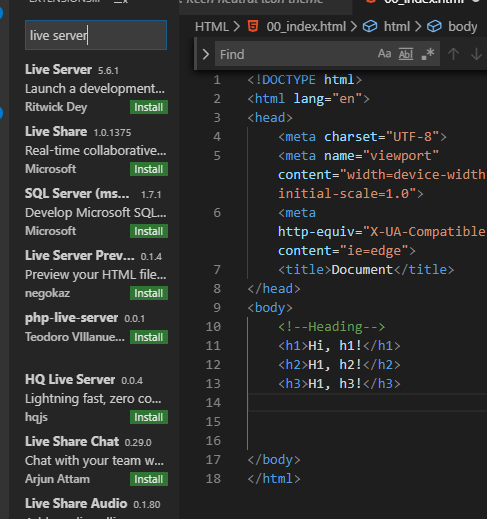

## 191212 오늘의 학습내용

>  챗 봇을 만들 때 필요한 서버를 만드는 연습!
>
>  파이선 기반 웹프로그램인 플라스크에 대해 배울 것
>
>  다른 프로젝트에도 사용될 수 있으므로  연습 또 연습

## HTML 기본 태그 학습

* !+ tap -> 기본골격 생성
* Live Server 
  * 변경사항을 바로 임의서버에 반영해 확인시켜주는 확장 프로그램

