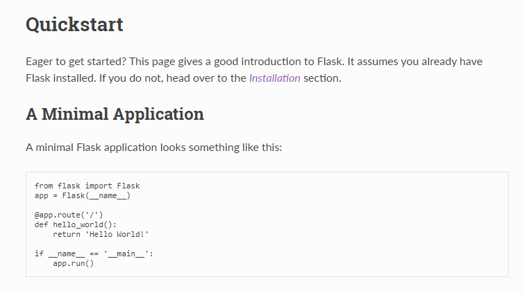
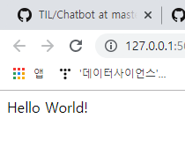

## 191212 오늘의 학습내용

>  챗 봇을 만들 때 필요한 서버를 만드는 연습!
>
>  파이선 기반 웹프로그램인 플라스크에 대해 배울 것
>
>  다른 프로젝트에도 사용될 수 있으므로  연습 또 연습


## HTML 기본 태그 학습

* !+ tap -> 기본골격 생성
* Live Server 
  * 변경사항을 바로 임의서버에 반영해 확인시켜주는 확장 프로그램


# Flask

## 1. 설치 및 개발서버 실행 

- flask docs를 살펴보기
- 가상환경에 진입
- `pip install flask`
- flask 폴더 생성 -> app.py라는 파일을 생성 -> quickstart 페이지의 minimal application의 코드를 복사해 붙이기
  - quickstart와 다르게 파일 명을 hello.py라고 지정하지 않고 app.py로 지정했는데, 이는 디폴트가 app.py로 설정되어 있기 때문. 설치 과정 하나를 줄일 수 있다.





* 아래 그림에서 로컬 서버가 만들어진 것을 볼 수 있다

  

* 화면에 뜬 웹 주소를 ctl+ click 하면 페이지가 열린다



* 서버를 실행하려면 app.py파일이 있는 곳에서 실행해야 한다 

  ```python
  ls
  # 폴더 안 파일 확인 명령어
  ```

  

* 


## 2. Flask 기초

* 수정사항을 반영하려면 서버를 껐다 켜야 하는 불편함이 있음 
* 이를 개선하기 위해 다음의 코드를 입력

### 2.1 Render Templates

> 단순 문자열을 return 하지 않고, 페이지를 render하기 위해 사용

* templates 폴더 생성 **"위치 주의"**

  * app.py와 같은 경로에 탬플릿 폴더를 생성한다 ( flask 하위폴더)

    ```html
    flask/
    	templates/
        	index.html
            ...
        app.py
    ```

    

  * 사용자에게 보여줄 external page를 담는 폴더명은 반드시 templates여야만 한다.

* app.py 코드 수정

  * render tamplate 모듈을 불러온다

    

  * app 함수를 html페이지를 render하도록 변경한다

    

  * 

  ```python
  from flask import Flask, render_template
  
  @app.route('/')
  def hello_world():
      return render_template('index.html')
  ```

  

  ### 2.2 Variable Routing

  > Variable Routing이 왜 필요할까? 
  >
  > 
  >
  > 예를 들어 영화 웹페이지를 만들 때, 영화의 개수가 5로 적은 페이지라면, 각각의 페이지를 만들어서 페이지를 열어주면 된다. 
  >
  > 하지만, 영화의 개수가 많아질 수록, 모든 페이지를 만들기 어렵기 때문에, 대신 영화 db에 접근하여, 입력한 영화만 출력해주는게 훨씬 효율적이다. 
  >
  > 이를 위해 , html에는 지정 영화에 대해 출력하는 template만 만들어 둔 뒤,  검색한 데이터를 페이지에 연동해 출력해주기만 하면 된다.
>
  > 이것을 가능하게 하는 기술이 Variable Routing이다.
  >
  > DB에서 변수를 잡고, 해당 변수를 render_template함수를 이용하여, 전달할 html페이지 이름과, 사용할 변수의 이름을 지정해 넘겨줄 수 있기 때문이다.
  
  

URL로 요청을 받고, 단순 문자열 형태로 돌려줄 수 있다.

  ```python
  # 인사해주는 페이지	
  @app.route('/greeting/<string:name>')
  def greeting(name):
      return f'{name}님 안녕?'
  ```
마찬가지로 미리 준비해둔 템플릿을 리턴해줄 수도 있다.

  ```python
  # 세 베곱을 돌려주는 페이지
  @app.route('/cube/<int:number>')
  def cube(number):
      result = number **3
      # return f'{number}의 세제곱의 값은 {number**3}입니다'
      return render_template('cube.html', number=number, result = result)
  ```

  


### 2.3 템플릿엔진(jinja2) 활용하기 

flask 내장된 template 중 하나.

> 함수 안에서 데이터를 가공한 뒤, HTML 태그 형태로 가공해서 템플릿에 보내주는 작업은 너무나 번거롭고 힘들다. 
>
> 따라서 단순 문자면 문자, 리스트면 리스트 그대로 탬플릿에 넘겨 준 뒤, Flask에 내장된 탬플릿 엔진을 통해 탬플릿 안에서 데이터를 가공해보자.


* 조건문

  ```python
  @app.route('/greeting/<string:name>')
  def greeting(name):
      return render_template('greeting.html', html_name=name)
  # html_name은 name을 받아서 template에서 사용할때 적용할 이름
  # = 받은 이름 --> 이것을 html을 통해 출력하려면 html문서에 {{html_name}}로 표시해줘야
  ```

  ```html
  <!-- jinja를 이해하기 위해 관리자와 사용자의 페이지를 다르게 표현해준다면 -->
      
          <h3> 충성! {{ html_name}} 관리자님 반갑습니다.</h3>
      
          <h5> {{html_name}}님, 즐거운 시간되세요.</h5>
      
  ```

  

* 반복문

  ```python
  @app.route('/movie')
  def movie():
      movies = ['나이브스 아웃', '조커', '엔드게임']
      return render_template('movie.html', movie_list=movies)
      
  ```

  ```html

    <h2> 재미있는 영화 목록</h2>
  <ol>
       <!--제어문 작성-->
      <li>{{movie}}</li> <!--값을 출력-->
      
  </ol>
  ```


  ```

  ```

