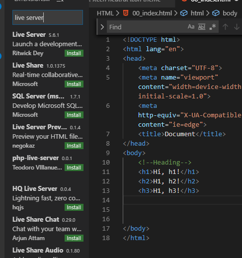
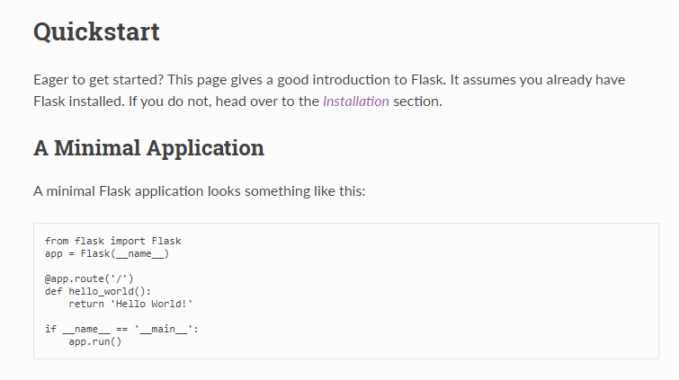
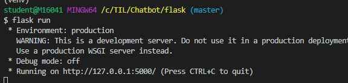
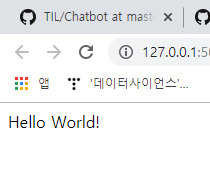

## 191212 오늘의 학습내용

>  챗 봇을 만들 때 필요한 서버를 만드는 연습!
>
>  파이선 기반 웹프로그램인 플라스크에 대해 배울 것
>
>  다른 프로젝트에도 사용될 수 있으므로  연습 또 연습


## HTML 기본 태그 학습

* !+ tap -> 기본골격 생성
* Live Server 
  * 변경사항을 바로 임의서버에 반영해 확인시켜주는 확장 프로그램




# Flask

## 1. 설치 및 개발서버 실행

> 공식문서를 기준으로 Flask를 설치하고 개발용 서버를 실행해보자. 
>
> flask docs를 살펴보기

* **가상환경에 진입**

* **Install Flask**

  ```bash
  (venv)
  $ pip install Flask
  ```

* **설치 여부 확인**

  ```bash
  (venv)
  $ pip list
  
  Package           Version   
  ----------------- ----------
  ...     
  Flask             1.1.1 
  ...
  ```

* flask 폴더 생성 -> app.py라는 파일을 생성 -> quickstart 페이지의 minimal application의 코드를 복사해 붙이기

  - quickstart와 다르게 파일 명을 hello.py라고 지정하지 않고 app.py로 지정했는데, 이는 디폴트가 app.py로 설정되어 있기 때문. 설치 과정 하나를 줄일 수 있다.
  
    
  
  
  
* **개발 서버 실행하기**

  ```python
  # app.py
  
  from flask import Flask
  app = Flask(__name__)
  
  @app.route('/')
  def hello_world():
      return 'Hello, World!'
  ```

  ```bash
  TIL/
    Chatbot/
       flask/
       	app.py
  ```

  ```bash
  $ flask run
  ```

  * 아래 그림에서 로컬 서버가 만들어진 것을 볼 수 있다

    

  * 화면에 뜬 웹 주소를 ctl+ click 하면 페이지가 열린다

  

* 서버를 실행하려면 app.py파일이 있는 곳에서 실행해야 한다 

  ```python
  ls
  # 폴더 안 파일 확인 명령어
  ```
  
  
  
* flask run으로 서버를 실행할 경우, `app.py`의 내용이 바뀌면 서버를 재실행해야 한다는 단점이 있다. `app.py`의 맨 아래에 코드를 조금 추가해보자.

  ```python
  from flask import Flask
  app = Flask(__name__)
  
  @app.route('/')
  def hello_world():
      return 'Hello, World!'
  
  # (중요) app.py 가장 하단에 위치
  if __name__ == '__main__':
      app.run(debug=True)
  ```

* 앞으로 서버를 실행할 때 `python app.py` 라는 명령어를 실행하자.

  * 이렇게 실행된 서버의 경우 app.py의 내용이 변경되면 서버를 껐다 켜지 않아도 새로고침만 하면 반영되어있는 것을 확인할 수 있다.
  * 반드시 app.py가 있는 폴더에 위치하고 있는지 확인하고 명령어를 실행하자.

  ```bash
  TIL/Chatbot/flask
  $ python app.py
  ```


## 2. Flask 기초

### 2.1 Render Template

> 단순 문자열을 리턴해주지 않고, 미리 준비해둔 템플릿을 사용자에게 보여주자.

* **templates 폴더 생성**

  app.py와 같은 경로에 템플릿 폴더를 생성한다.

  폴더명은 반드시 `templates`로 생성한다.

  ```
  flask/
  	templates/
  		index.html
  		...
  	app.py
  ```

* `app.py` 코드 수정

  ```python
  from flask import Flask, render_template
  
  @app.route('/')
  def hello_world():
      return render_template('index.html')
  ```

### 2.2 Variable Routing

> URL 요청을 통해 사용자에게 임의의 값을 입력받고, 데이터를 적절하게 가공해서 사용자에게 응답을 해준다.

URL로 요청을 받고, 단순 문자열 형태로 돌려줄 수 있다.

```python
# 인사해주는 페이지
@app.route('/greeting/<string:name>')
def greeting(name):
    return f'{name}님 안녕?'
```

마찬가지로 미리 준비해 둔 템플릿을 리턴해줄 수도 있다.


```python
# 세제곱을 돌려주는 페이지
@app.route('/cube/<int:number>')
def cube(number):
    result = number ** 3
    return render_template('cube.html', number=number, result=result)
```


### 2.3 템플릿 엔진(jinja2) 활용하기

> 함수 안에서 데이터를 가공한 뒤, HTML 태그 형태로 가공해서 템플릿에게 보내주는 작업은 너무나 번거롭고 힘들다.
>
> 따라서 단순 문자면 문자, 리스트면 리스트 그대로 템플릿에 넘겨준 뒤, Flask에 내장된 템플릿 엔진을 통해 템플릿 단에서 제어문을 이용해서 데이터를 가공해서 보여주자.

* **조건문**

  ```python
  @app.route('/greeting/<string:name>')
  def greeting(name):
      return render_template('greeting.html', html_name=name)
  ```

  ```html
  
  <h3>충성! {{ html_name }} 관리자님 반갑습니다.</h3>
  
  <h5>{{ html_name }}님, 즐거운 시간 되세요.</h5>
  
  ```

* **반복문**

  ```python
  @app.route('/movie')
  def movie():
      movies = ['나이브스 아웃', '조커', '엔드게임']
      return render_template('movie.html', movie_list=movies)
  ```

  ```html
  <h2>재밌는 영화 목록</h2>
  <ol>
      
      <li>{{ movie }}</li>
      
  </ol>
  ```


## 3. Flask의 요청(Request)-응답(Response)

> 웹은 기본적으로 요청-응답이라는 두 개의 로직으로 동작한다.
> Flask를 통해 요청-응답 구조를 이해하고 특정 기능을 구현해보자.

### 3.1 Ping-Pong

* 사용자가 `/ping` 이라는 경로로 들어오면, 우리 서버에 어떠한 데이터를 보낼 수 있는 form이 포함되어 있는 템플릿을 보여주자.

  ```python
  @app.route('/ping')
  def ping():
      return render_template('ping.html')
  ```

  ```html
  <form action="/pong">
      나이: <input type="text" name="age"><br>
      <input type="submit">
  </form>
  ```

* 사용자가 제출 버튼을 누르고 우리 서버의 `/pong` 경로로 요청을 보내면, 서버 내부적으로 데이터를 가공한 뒤 사용자에게 템플릿을 돌려주는 방식으로 응답해주자.

  ```python
  @app.route('/pong')
  def pong():
      age = request.args.get('age')
      return render_template('pong.html', age=age)
  ```

  ```html
  <h4>요청 잘 받았고, 응답 받아라 !!</h4>
  <h5>{{ age }}살 맞냐?</h5>
  ```

### 3.2 Fake NAVER & Google

> 사용자는 우리 서버에서 제공한 form을 통해 어디론가 요청을 보낼 수 있다.
> 요청을 보내는 장소는 우리 서버 뿐만 아니라, 다른 서버에 요청을 보낼 수도 있다. 네이버와 구글 서버에서 검색 기능을 담당하는 URL로 요청을 보내보자.

```python
@app.route('/naver')
def naver():
    return render_template('naver.html')

@app.route('/google')
def google():
    return render_template('google.html')
```

```html
<form action="https://search.naver.com/search.naver">
    검색어: <input type="text" name="query"><br>
    <input type="submit" value="검색">
</form>
```

```html
<form action="https://www.google.com/search">
    <input type="text" name="q">
    <input type="submit" value="검색">
</form>
```


## 4. Flask 유잼

### 3.1 신이 나를 만들 때

```python
# 사용자로부터 입력받을 페이지를 렌더링해줌.
@app.route('/vonvon')
def vonvon():
    return render_template('vonvon.html')

# 요청을 받은 뒤 데이터를 가공해서 사용자에게 응답해줌.
@app.route('/godmademe')
def godmademe():
    name = request.args.get('name')
    
    # 데이터 리스트
    first_options = ['잘생김', '못생김', '존잘', '존못', '쏘쏘']
    second_options = ['친절함', '싹수', '애교', '잘난척']
    third_options = ['돈복', '코딩력', '물욕', '식욕']

    # 각 데이터 리스트 별로 요소를 하나씩 무작위로 뽑음
    # sample 사용한 경우 (list 형태로 들어옴)
    tmp = random.sample(first_options, 1)
    print(tmp, type(tmp), tmp[0])
    #=> ['잘생김'] <class 'list'> 잘생김
    
    # choice 사용한 경우 (str 형태로 들어옴)
    first = random.choice(first_options)
    print(first, type(first))
    #=> 잘생김 <class 'str'>

    second = random.choice(second_options)
    third = random.choice(third_options)

    # 뽑은 데이터를 템플릿에 넘겨줌
    return render_template('godmademe.html', name=name, first=first, second=second, third=third)
```

```html
<h2>신이 {{ name }}을 만들 때...</h2>
<h5>{{ first }}를 듬뿍~</h5>
<h5>{{ second }}도 필요하려나?</h5>
<h5>{{ third }}? 뭔지 모르겠는데 많이 넣었닼ㅋㅋ</h5>
```


